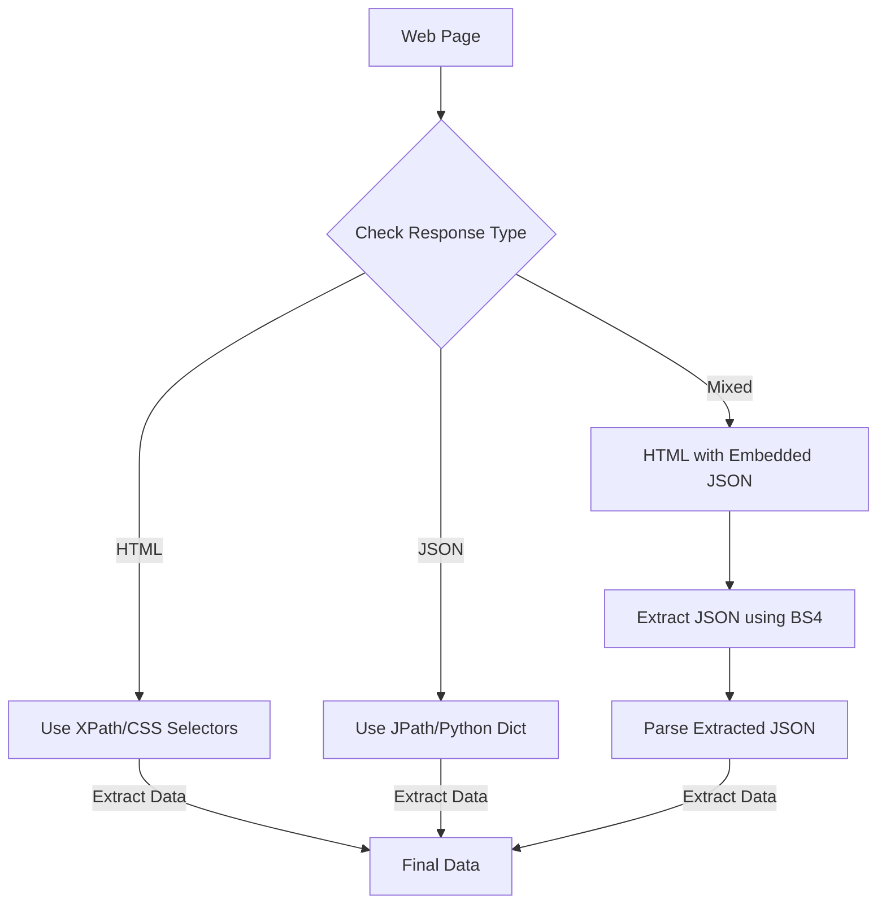
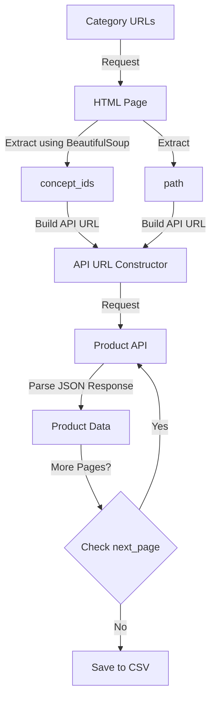
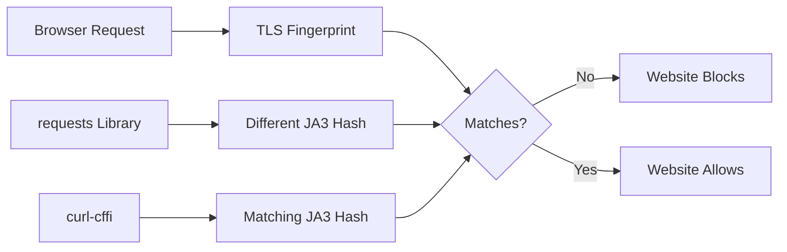
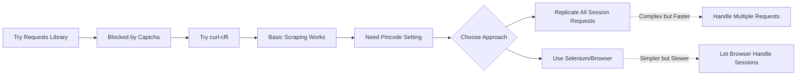
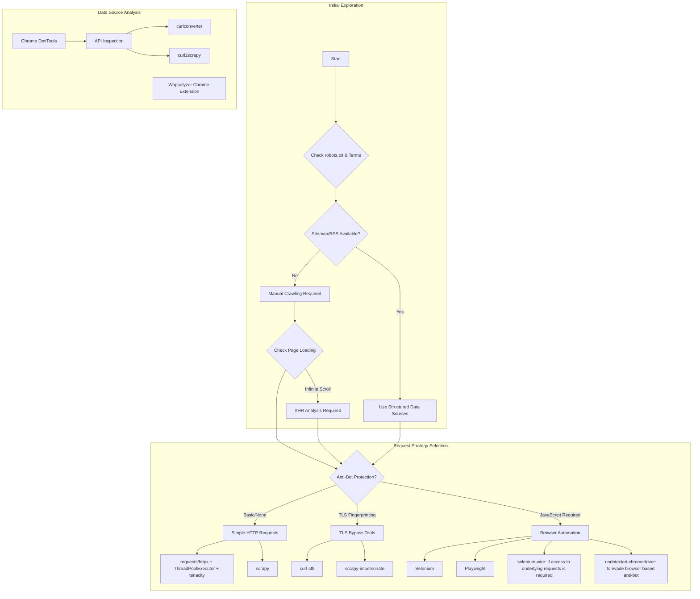
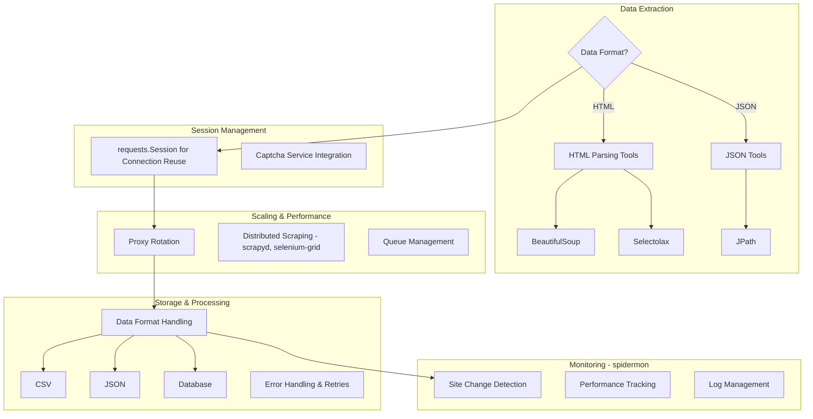

# Extract Summit_Local Chapter India

```mermaid
graph TD
    A[Web Page] --> B{Check Response Type}
    B -->|HTML| C[Use XPath/CSS Selectors]
    B -->|JSON| D[Use JPath/Python Dict]
    B -->|Mixed| E[HTML with Embedded JSON]
    E --> F[Extract JSON using BS4]
    F --> G[Parse Extracted JSON]
    
    C -->|Extract Data| H[Final Data]
    D -->|Extract Data| H
    G -->|Extract Data| H    
```
---

```mermaid
flowchart TD
    A[Category URLs] -->|Request| B[HTML Page]
    B -->|Extract using BeautifulSoup| C[concept_ids]
    B -->|Extract| D[path]
    
    C -->|Build API URL| E[API URL Constructor]
    D -->|Build API URL| E
    
    E -->|Request| F[Product API]
    F -->|Parse JSON Response| G[Product Data]
    
    G -->|More Pages?| H{Check next_page}
    H -->|Yes| F
    H -->|No| I[Save to CSV]
```
---

```mermaid
flowchart LR
    A[Browser Request] --> B[TLS Fingerprint]
    B --> C{Matches?}
    
    D[requests Library] --> E[Different JA3 Hash]
    E --> C
    
    F[curl-cffi] --> G[Matching JA3 Hash]
    G --> C
    
    C -->|No| H[Website Blocks]
    C -->|Yes| I[Website Allows]
```
---

```mermaid
flowchart LR
    A[Try Requests Library] --> B[Blocked by Captcha]
    B --> C[Try curl-cffi]
    C --> D[Basic Scraping Works]
    D --> E[Need Pincode Setting]
    E --> F{Choose Approach}
    F --> G[Replicate All Session Requests]
    F --> H[Use Selenium/Browser]
    
    G -.->|Complex but Faster| I[Handle Multiple Requests]
    H -.->|Simpler but Slower| J[Let Browser Handle Sessions]
```
---

```mermaid
flowchart TD
    subgraph InitialExploration["Initial Exploration"]
        A[Start] --> B{Check robots.txt & Terms}
        B --> C{Sitemap/RSS Available?}
        C -->|Yes| D[Use Structured Data Sources]
        C -->|No| E[Manual Crawling Required]
        E --> F{Check Page Loading}
        F -->|Infinite Scroll| G[XHR Analysis Required]
    end

    subgraph RequestStrategy["Request Strategy Selection"]
        H{Anti-Bot Protection?}
        H -->|Basic/None| I[Simple HTTP Requests]
        I --> I1[requests/httpx + ThreadPoolExecutor + tenacity]
        I --> I2[scrapy]
        
        H -->|TLS Fingerprinting| J[TLS Bypass Tools]
        J --> J1[curl-cffi]
        J --> J2[scrapy-impersonate]
        
        H -->|JavaScript Required| K[Browser Automation]
        K --> K1[Selenium]
        K --> K2[Playwright]
        K --> K3[selenium-wire: if access to underlying requests is required]
        K --> K4[undetected-chromedriver: to evade browser based anti-bot]
    end

    subgraph DataSourceAnalysis["Data Source Analysis"]
        L[Chrome DevTools]
        M[Wappalyzer Chrome Extension]
        L --> N[API Inspection]
        N --> O1[curlconverter]
        N --> O2[curl2scrapy]
    end

    F --> H
    G --> H
    D --> H
```
---

```mermaid
flowchart TD
    subgraph DataExtraction["Data Extraction"]
        A{Data Format?}
        A -->|HTML| B[HTML Parsing Tools]
        B --> B1[BeautifulSoup]
        B --> B2[Selectolax]
        
        A -->|JSON| C[JSON Tools]
        C --> C1[JPath]
    end

    subgraph SessionManagement["Session Management"]
        D[requests.Session for Connection Reuse]
        E[Captcha Service Integration]
    end

    subgraph ScalingPerformance["Scaling & Performance"]
        F[Proxy Rotation]
        G[Distributed Scraping - scrapyd, selenium-grid]
        H[Queue Management]
    end

    subgraph StorageProcessing["Storage & Processing"]
        I[Data Format Handling]
        I --> I1[CSV]
        I --> I2[JSON]
        I --> I3[Database]
        J[Error Handling & Retries]
    end

    subgraph Monitoring["Monitoring - spidermon"]
        K[Site Change Detection]
        L[Performance Tracking]
        M[Log Management]
    end

    A --> D
    D --> F
    F --> I
    I --> K
```
---
